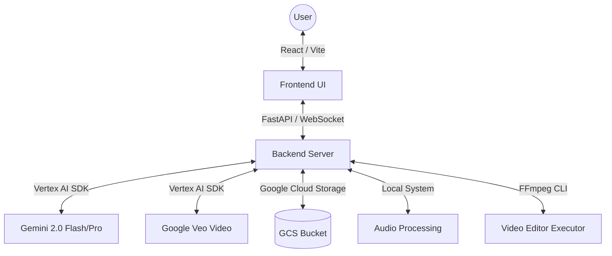

# Vibe | Multimodal Studio

A premium, node-based multimodal creative studio powered by Google Gemini and Veo. Create images, videos, and audio in a seamless, interactive workspace.

## 🏗️ Technical Architecture



## 🚀 Local Development

### Prerequisites
- Python 3.11+
- Node.js 18+
- Google Cloud CLI configured with project access

### 1. Backend Setup
```bash
# Navigate to backend directory
cd backend

# Create virtual environment
python -m venv venv
source venv/bin/activate

# Install dependencies
pip install -r requirements.txt

# Run server
uvicorn main:app --reload --port 8000
```

### 2. Frontend Setup
```bash
# Navigate to frontend directory
cd frontend

# Install dependencies
npm install

# Run dev server
npm run dev
```

The application will be available at `http://localhost:8000` (proxied through the backend).

## ☁️ Google Cloud Deployment

### 1. GCP Project Setup
- Enable **Vertex AI API** and **Cloud Storage API**.
- Create a Cloud Storage bucket for assets.
- Create a **Service Account** with the following roles:
  - `Vertex AI User`
  - `Storage Object Admin`
- Download the Service Account JSON key as `service-account.json` in the `backend/` directory (or set `GOOGLE_APPLICATION_CREDENTIALS`).

### 2. Environment Variables
Ensure the following are set in your environment or Cloud Run configuration:
- `GOOGLE_CLOUD_PROJECT`: Your GCP Project ID.
- `GCS_BUCKET_NAME`: Name of your storage bucket.

### 3. Deploy to Cloud Run
Run the deployment script from the root directory:
```bash
chmod +x deploy.sh
./deploy.sh
```

## 🛠️ To-Dos & Requirements
- [x] Integrate Gemini 2.0 for Image Generation.
- [x] Integrate Veo for Video Generation.
- [x] Video Editor Node for multi-track sequencing (FFmpeg).
- [x] Custom Node-based Canvas UI.
- [x] History Panel with thumbnails and scroller.
- [x] Premium Branding with Infinity Icon & Animations.
- [ ] Implement user authentication.
- [ ] Add support for custom fine-tuned models.

## 📜 License
MIT
