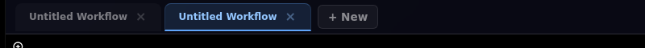
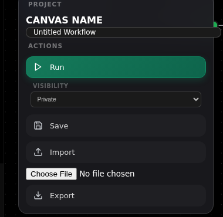
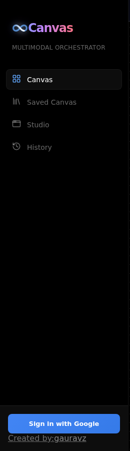
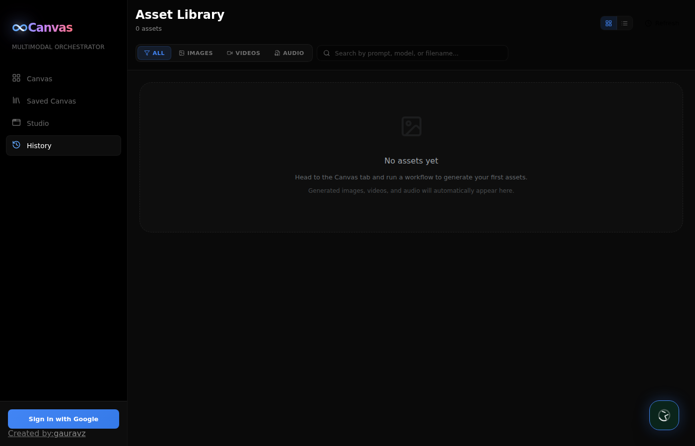
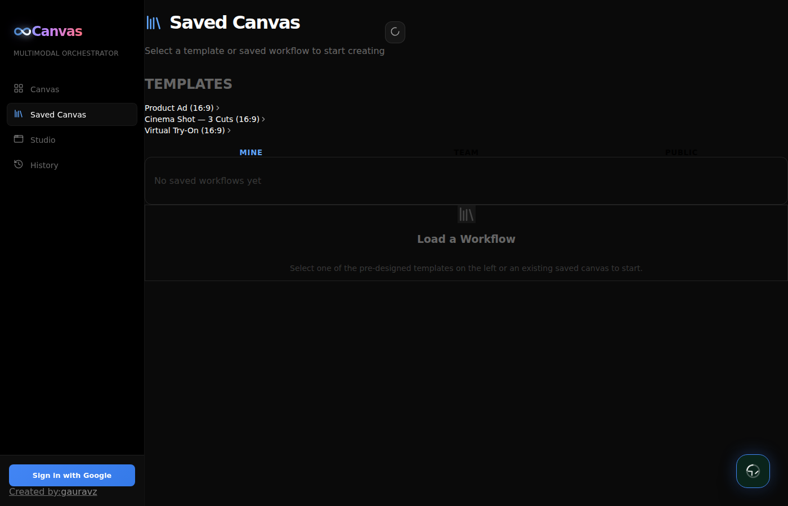

# Canvas — Multimodal Orchestrator User Guide

Canvas is a visual node-based workflow engine for AI-powered media generation. Build pipelines that chain Gemini, Veo, Lyria, and TTS models together to create images, audio, and videos.

**Live URL:** https://vibe-studio-refactor-440790012685.us-central1.run.app

---

## Contents

1. [Getting Started](#getting-started)
2. [Interface Overview](#interface-overview)
3. [Workflow Tabs](#workflow-tabs)
4. [Node Types](#node-types)
5. [Building a Workflow](#building-a-workflow)
6. [Saving & Sharing](#saving--sharing)
7. [Teams](#teams)
8. [Asset Library](#asset-library)
9. [Templates](#templates)
10. [Local Development](#local-development)
11. [Supported Models](#supported-models)

---

## Getting Started

### Sign In

Click **"Sign in with Google"** at the bottom of the sidebar to authenticate. Sign-in enables saving workflows under your account, joining teams, and seeing your personal asset history. The app also works without sign-in (assets save under a default user).


---

## Interface Overview

| Tab | Purpose |
|-----|---------|
| **Canvas** | Visual workflow editor — build and run node pipelines |
| **Saved Canvas** | Browse templates, your saved workflows, team workflows, and public workflows |
| **Studio** | Quick-access panels for individual AI tools (no graph needed) |
| **History** | Asset Library — every generated media file is auto-saved here |

---

## Workflow Tabs



Work on multiple workflows in parallel:

- **"+ New"** — Create a new blank workflow tab
- **Click** any tab to switch to it — state is preserved
- **Double-click** a tab name to rename it inline
- **"x"** — Close a tab (can't close the last one)
- **All tabs stay mounted simultaneously** — switching between Canvas/Saved Canvas/History never loses workflow state

---

## Node Types

All node types are available from the toolbar on the left side of the canvas.

### Inputs
| Node | Description |
|------|-------------|
| Input (Text) | Type a text prompt |
| Input (Image) | Upload an image |
| Input (Video) | Upload a video (auto-uploads to GCS for Veo Extend/Upscale) |
| Input (Audio) | Upload an audio file |

### Gemini
| Node | Input | Output | Default Model |
|------|-------|--------|---------------|
| Gemini Text | Text, Image, Audio/Video | Text | gemini-3.1-flash-lite-preview |
| Gemini Image | Text, Image | Image | gemini-3.1-flash-image-preview |

### Voice & Music
| Node | Input | Output | Notes |
|------|-------|--------|-------|
| Speech Gen | Text | Audio | 23 languages, 7 voices, system instructions |
| Lyria Clip | Text | Audio (30s) | Quick music generation |
| Lyria Pro | Text + Image | Audio (full song) | Image-conditioned music with lyrics |

### Video
| Node | Input | Output | Notes |
|------|-------|--------|-------|
| Veo Standard | Text + first/last frame | Video | Default video generation |
| Veo Extend | Text + Video | Extended video | Lite model NOT supported (auto-upgrades) |
| Veo Reference | Text + Image (subject ref) | Video | Lite model NOT supported (auto-upgrades) |
| Video Upscaler | Video | Video (4K) | Sharpness 0-4, 4K or 1080p |

### Utility
| Node | Description |
|------|-------------|
| Image Upscaler | Upscale images using Imagen |
| Video Editor | Combine multiple videos + speech + background music with ffmpeg |
| Output | Display and download generated content |

---

## Building a Workflow

### Adding & Connecting Nodes

1. **Click** any node type in the toolbar to add to canvas
2. Or **drag** a node type onto the canvas
3. Drag from a node's **output handle** (right side, green) to another node's **input handle** (left side, blue)

### Running

1. Configure each node (model, voice, language, aspect ratio)
2. Click **Run** in the toolbar — execution streams via SSE in real-time
3. Each node shows: `running` → `completed` (green) or `failed` (red)
4. **If a node fails, downstream nodes are auto-skipped** with clear error messages

### Per-Node Controls

- **Run from this node** (▶ icon) — Run the clicked node + all downstream nodes only
- **Delete** (× icon) — Remove the node

---

## Saving & Sharing

### Visibility

In the toolbar, choose visibility before saving:

| Visibility | Who sees it |
|-----------|------------|
| **Private** | Only you (default) |
| **Team** | Members of selected team |
| **Public** | Everyone |

### Save / Export / Import

- **Save** — Persist to server with chosen visibility
- **Export** — Download workflow as JSON (option to include media or strip it)
- **Import** — Load a workflow JSON file into the current tab



---

## Teams

### Create a Team
1. In the sidebar **Teams** section, click **"+"**
2. Enter team name → automatic 8-character **join code** generated

### Join a Team
1. Click **"Join a Team"** in the sidebar
2. Enter the join code shared by a team member

### Share Join Code
Click the **[code]** button next to any team to copy its join code.

### Team Workflows
Save a workflow with **Team** visibility → all team members see it under **Saved Canvas → Team** tab.



---

## Asset Library



Every generated asset (image, video, audio) is **automatically saved** with:
- Full prompt text
- Model used
- Timestamp
- File type and MIME

### Features
- **Filter** by type: All / Images / Videos / Audio
- **Search** by prompt text
- **Grid or list view** toggle
- **Expandable prompts** — click "More" for full text
- **Model badges** — see which model generated each asset
- **Download** any asset directly

---

## Templates



Three production-ready templates in **Saved Canvas → Templates**:

### 1. Product Ad (16:9)
**Inputs:** Product Photo, Brand Brief, Visual Style
**Pipeline:** Stylize image → 4K hero image + Veo video (4K) → +voice +music → final ad
**Use case:** Generate complete product ads from a photo and short brief

### 2. Cinema Shot — 3 Cuts (16:9)
**Inputs:** Character (photo + description), Scene Setting
**Pipeline:** Character reference → 3 framing-only shots (wide/medium/close-up) → 3 Veo clips → Lyria Pro score → cinematic sequence
**Use case:** Cinematic content with character continuity across multiple shots

### 3. Virtual Try-On (16:9)
**Inputs:** Person Photo, Garment Photo, Background, Motion Direction
**Pipeline:** VTO (preserves face) → background swap → animate → +music → fashion reel
**Use case:** Fashion content showing a person trying on garments in different settings

### Editing Templates
1. Click the **gear icon** next to any saved workflow → opens in a **new tab** (preserves your other work)
2. Or click the workflow name → preview pane → **"Open in New Tab to Edit"**
3. Templates are scaffolds — empty inputs ready for you to fill in

---

## Local Development

### Prerequisites
- Python 3.11+, Node.js 18+
- Google Cloud project with Vertex AI enabled
- Firebase project with Google sign-in (optional, for auth)

### Setup

```bash
git clone https://github.com/gauravz7/canvas.git
cd canvas

# Backend
cd backend
pip install -r requirements.txt
GOOGLE_CLOUD_PROJECT=your-project-id \
FIREBASE_PROJECT_ID=your-project-id \
PYTHONPATH=$(pwd):$(pwd)/backend \
uvicorn main:app --host 0.0.0.0 --port 8000 --reload

# Frontend (new terminal)
cd frontend
npm install
npm run dev  # http://localhost:5175
```

### Environment Variables

| Variable | Required | Purpose |
|----------|----------|---------|
| `GOOGLE_CLOUD_PROJECT` | Yes | GCP project ID |
| `FIREBASE_PROJECT_ID` | No | Firebase project (defaults to GCP project) |
| `CORS_ORIGINS` | No | Allowed origins (default: `http://localhost:5175`) |
| `VEO_BUCKET` | No | GCS bucket for video storage (default: `genmedia-canvas`) |
| `VITE_FIREBASE_API_KEY` | For login | Firebase web API key (frontend `.env`) |
| `VITE_FIREBASE_AUTH_DOMAIN` | For login | Firebase auth domain |
| `VITE_FIREBASE_PROJECT_ID` | For login | Firebase project ID |

### Deploy to Cloud Run

```bash
export GOOGLE_CLOUD_PROJECT=your-project
./deploy.sh
```

### Tests

```bash
cd frontend
npx playwright install chrome
npx playwright test
```

---

## Supported Models

### Text Generation
- `gemini-3.1-flash-lite-preview` (default)
- `gemini-3.1-pro-preview`
- `gemini-3-flash-preview`

### Image Generation
- `gemini-3.1-flash-image-preview` (default)
- `gemini-3-pro-image-preview`
- `gemini-2.5-flash-image`

### Video Generation
- `veo-3.1-lite-generate-001` (default — fastest, cheapest)
- `veo-3.1-fast-generate-001`
- `veo-3.1-generate-001` (highest quality)

**Note:** `lite` does NOT support **Reference** or **Extend** — frontend hides it for those nodes; engine auto-upgrades to `fast` if encountered.

### Music Generation
- `lyria-3-clip-preview` (default — 30s clips)
- `lyria-3-pro-preview` (full songs with image input + generated lyrics)
- `lyria-002` (legacy)

### Text-to-Speech
- `gemini-3.1-flash-tts-preview` (default)
- `gemini-2.5-flash-preview-tts`
- `gemini-2.5-pro-preview-tts`

**23 languages, 7 voices** (Kore, Leda, Puck, Charon, Fenrir, Aoede, Enceladus). Supports system instructions for style control.

### Image Upscale
- `imagen-4.0-upscale-preview`

### Video Upscale
- `veo-3.1-generate-001` (4K, sharpness 0-4)
