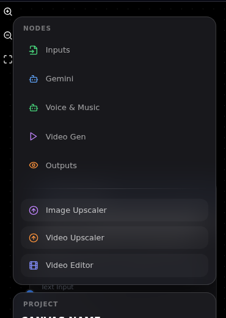
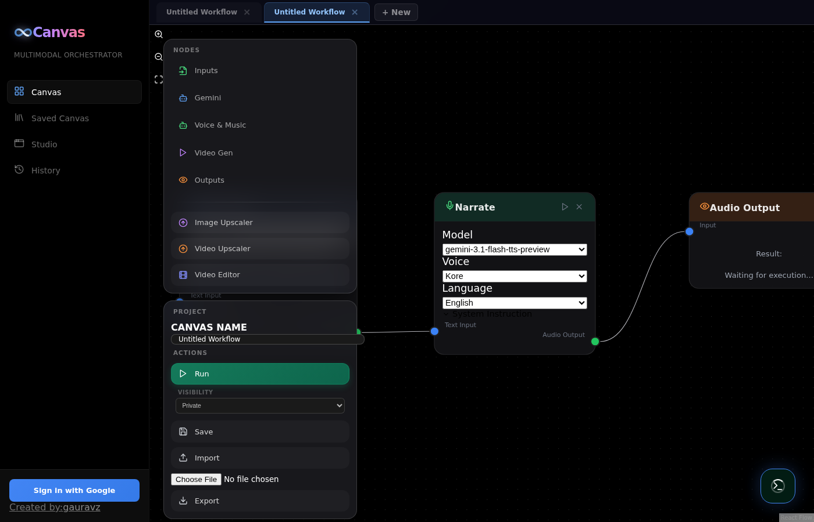
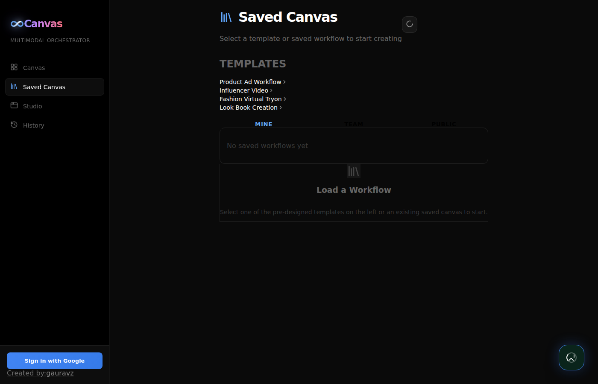

# Canvas - Multimodal Orchestrator User Guide

Canvas is a visual node-based workflow engine for AI-powered media generation. Build workflows by connecting nodes that generate text, images, audio, video, and more using Google's Gemini, Veo, Lyria, and TTS models.

**Live URL:** https://vibe-studio-refactor-440790012685.us-central1.run.app

---

## Table of Contents

1. [Getting Started](#getting-started)
2. [The Canvas Editor](#the-canvas-editor)
3. [Node Types](#node-types)
4. [Building a Workflow](#building-a-workflow)
5. [Running Workflows](#running-workflows)
6. [Workflow Tabs](#workflow-tabs)
7. [Saving & Sharing](#saving--sharing)
8. [Teams](#teams)
9. [Asset Library](#asset-library)
10. [Saved Canvas](#saved-canvas)
11. [Studio Panel](#studio-panel)
12. [Local Development](#local-development)

---

## Getting Started

### Sign In

Click **"Sign in with Google"** at the bottom of the sidebar to authenticate. This enables saving workflows, team collaboration, and personalized asset history.


### Interface Overview

The app has four main sections accessible from the sidebar:

| Tab | Purpose |
|-----|---------|
| **Canvas** | Visual workflow editor - build and run node pipelines |
| **Saved Canvas** | Browse and manage saved workflows (yours, team, public) |
| **Studio** | Quick-access panels for individual AI tools |
| **History** | Asset library of all generated media |

---

## The Canvas Editor

The canvas is where you build workflows by connecting nodes visually.

### Toolbar (Left Panel)



The toolbar contains all available node types organized by category:

- **Inputs** - Text, Image, Video, Audio input nodes
- **Gemini** - Text generation and image generation
- **Voice & Music** - Speech synthesis, Lyria Clip, Lyria Pro
- **Video Gen** - Veo Standard, Extend, Reference
- **Outputs** - Display results (text, image, audio, video)
- **Utilities** - Image Upscaler, Video Upscaler, Video Editor

### Adding Nodes

Two ways to add nodes:
1. **Click** a node type in the toolbar to add it to the canvas
2. **Drag** a node type from the toolbar onto the canvas

### Connecting Nodes

Click and drag from an **output handle** (right side, green dot) to an **input handle** (left side, blue dot) on another node. Connections define how data flows between nodes.

### Actions

Below the node palette, the toolbar has:

- **Canvas Name** - Name your workflow
- **Run** - Execute the entire workflow
- **Visibility** - Set to Private, Team, or Public before saving
- **Save** - Save the workflow to the server
- **Import/Export** - Load or download workflow JSON files

---

## Node Types

### Input Nodes
| Node | Description |
|------|-------------|
| Input (Text) | Enter text prompts |
| Input (Image) | Upload an image file |
| Input (Video) | Upload a video file |
| Input (Audio) | Upload an audio file |

### Gemini Nodes
| Node | Input | Output | Models |
|------|-------|--------|--------|
| Gemini Text | Text, Image, Audio/Video | Text | gemini-3.1-flash-lite-preview, gemini-3.1-pro-preview |
| Gemini Image | Text, Image | Image | gemini-3.1-flash-image-preview, gemini-2.5-flash-image |

### Voice & Music Nodes
| Node | Input | Output | Models |
|------|-------|--------|--------|
| Speech Gen | Text | Audio (speech) | gemini-3.1-flash-tts-preview |
| Lyria Clip | Text | Audio (30s clip) | lyria-3-clip-preview |
| Lyria Pro | Text + Image | Audio (full song) | lyria-3-pro-preview |

**Speech Gen** features:
- **23 languages** including English, Spanish, French, German, Japanese, Korean, Chinese, Hindi, Arabic
- **7 voices**: Kore, Leda, Puck, Charon, Fenrir, Aoede, Enceladus
- **System Instruction**: Customize speaking style (e.g., "Speak cheerfully and with enthusiasm")

### Video Nodes
| Node | Input | Output | Models |
|------|-------|--------|--------|
| Veo Standard | Text + optional first/last frame | Video | veo-3.1-lite-generate-001, veo-3.1-fast-generate-001, veo-3.1-generate-001 |
| Veo Extend | Text + Video | Extended video | Same as above |
| Veo Reference | Text + Image | Video | Same as above |
| Video Upscaler | Video (from Veo) | Upscaled video (4K) | veo-3.1-generate-001 |

**Video Upscaler** options:
- Resolution: 4K or 1080p
- Aspect ratio: 16:9 or 9:16
- Sharpness: 0-4 slider
- Quality: Optimized or Lossless 16-bit PNG

### Utility Nodes
| Node | Input | Output |
|------|-------|--------|
| Image Upscaler | Image | Upscaled image |
| Video Editor | Videos + Speech + Background | Edited video |
| Output | Any | Displays the result |

---

## Building a Workflow

### Example: Text to Narrated Audio

1. Add a **Gemini Text** node
2. Type a prompt like "Explain quantum computing in 5 words"
3. Add a **Speech Gen** node
4. Connect Gemini Text's **Text Output** to Speech Gen's **Text Input**
5. Add an **Output** node
6. Connect Speech Gen's **Audio Output** to Output's **Input**
7. Click **Run**

### Example: Image Generation Pipeline

1. Add an **Input (Text)** node with a prompt
2. Add a **Gemini Image** node
3. Connect Input to Gemini Image's **Text Input**
4. Add an **Image Upscaler** node
5. Connect Gemini Image's **Image Output** to Upscaler's **Image Input**
6. Add an **Output** node to view the result

### Error Handling

If a node fails during execution:
- The failed node shows a **red "failed"** badge
- All downstream nodes are automatically **skipped** (shown in amber)
- The error message is displayed so you can identify the root cause

---

## Workflow Tabs



Work on multiple workflows simultaneously:

- **"+ New"** button creates a new blank workflow tab
- **Click** a tab to switch to it
- **Double-click** a tab name to rename it
- **"x"** button closes a tab (can't close the last one)
- Tab state is preserved when switching between Canvas, Saved Canvas, History, and Studio tabs

---

## Saving & Sharing

### Visibility Options

Before saving, choose the visibility level from the dropdown in the toolbar:

| Visibility | Who can see it |
|-----------|----------------|
| **Private** | Only you |
| **Team** | Members of a selected team |
| **Public** | Everyone |

When "Team" is selected, a second dropdown appears to choose which team to share with.

### Save

Click **Save** to store the workflow on the server. It appears in the **Saved Canvas** tab.

### Export / Import

- **Export** downloads the workflow as a JSON file (with option to include or exclude media)
- **Import** loads a workflow JSON file into the current canvas

---

## Teams

Create and join teams to collaborate on workflows.

### Create a Team
1. In the sidebar, find the **Teams** section (visible when signed in)
2. Click **"+"** next to "Teams"
3. Enter a team name and click **Create**
4. A **join code** is generated automatically

### Join a Team
1. Click **"Join a Team"** in the sidebar
2. Enter the join code shared by a team member
3. Click **Join**

### Share Join Code
Click the **[code]** button next to any team to copy its join code to the clipboard.

### Team Workflows
When saving a workflow with **Team** visibility, all team members can see it in their **Saved Canvas > Team** tab.

---

## Asset Library


Every generated media asset (images, audio, video) is automatically saved to the Asset Library with its prompt and model information.

### Features

- **Filter tabs**: All, Images, Videos, Audio
- **Search**: Filter assets by prompt text
- **Grid/List view**: Toggle between card grid and compact list
- **Expandable prompts**: Click "More" to see full prompt text
- **Model badges**: See which model generated each asset
- **Download**: Download any asset directly
- **Relative timestamps**: "5m ago", "3h ago" format

---

## Saved Canvas



Browse and manage workflows:

### Tabs
- **Mine** - Your saved workflows
- **Team** - Workflows shared by team members
- **Public** - Publicly shared workflows

### Templates
Pre-built example workflows are available at the top:
- Product Ad Workflow
- Influencer Video
- Fashion Virtual Tryon
- Look Book Creation

### Actions
- Click a workflow to preview it
- **"Open in Canvas"** loads it into the editor
- **Run** executes it directly from the panel

---

## Studio Panel

Quick-access panels for individual AI tools without building a full workflow:

- **Single Speaker TTS** - Generate speech from text
- **Multi Speaker TTS** - Multiple voices in one audio
- **Gemini Text** - Text generation
- **Gemini Image** - Image generation
- **Music Generation** - Create music with Lyria
- **Video Generation** - Generate videos with Veo
- **Image Upscale** - Upscale images

---

## Local Development

### Prerequisites
- Python 3.11+
- Node.js 18+
- Google Cloud project with Vertex AI enabled

### Setup

```bash
# Clone
git clone https://github.com/gauravz7/canvas.git
cd canvas

# Backend
cd backend
pip install -r requirements.txt
GOOGLE_CLOUD_PROJECT=your-project-id \
FIREBASE_PROJECT_ID=your-project-id \
PYTHONPATH=$(pwd):$(pwd)/backend \
uvicorn main:app --host 0.0.0.0 --port 8000 --reload

# Frontend (in another terminal)
cd frontend
npm install
npm run dev  # Runs on http://localhost:5175
```

### Environment Variables

| Variable | Required | Description |
|----------|----------|-------------|
| `GOOGLE_CLOUD_PROJECT` | Yes | GCP project ID |
| `FIREBASE_PROJECT_ID` | No | Firebase project (defaults to GCP project) |
| `CORS_ORIGINS` | No | Allowed origins (default: `http://localhost:5175`) |
| `VITE_FIREBASE_API_KEY` | No | Firebase web API key (frontend `.env`) |
| `VITE_FIREBASE_AUTH_DOMAIN` | No | Firebase auth domain (frontend `.env`) |
| `VITE_FIREBASE_PROJECT_ID` | No | Firebase project ID (frontend `.env`) |

### Running Tests

```bash
cd frontend
npx playwright install chrome
npx playwright test
```

### Deploy to Cloud Run

```bash
export GOOGLE_CLOUD_PROJECT=your-project-id
./deploy.sh
```

---

## Supported Models

### Text Generation
- `gemini-3.1-flash-lite-preview` (default)
- `gemini-3.1-pro-preview`
- `gemini-3-flash-preview`

### Image Generation
- `gemini-3.1-flash-image-preview` (default)
- `gemini-3-pro-image-preview`
- `gemini-2.5-flash-image`

### Video Generation
- `veo-3.1-lite-generate-001` (default)
- `veo-3.1-fast-generate-001`
- `veo-3.1-generate-001`

### Music Generation
- `lyria-3-clip-preview` (default, 30s clips)
- `lyria-3-pro-preview` (full songs with image input)
- `lyria-002` (legacy)

### Text-to-Speech
- `gemini-3.1-flash-tts-preview` (default)
- `gemini-2.5-flash-preview-tts`
- `gemini-2.5-pro-preview-tts`

### Image Upscale
- `imagen-4.0-upscale-preview`
